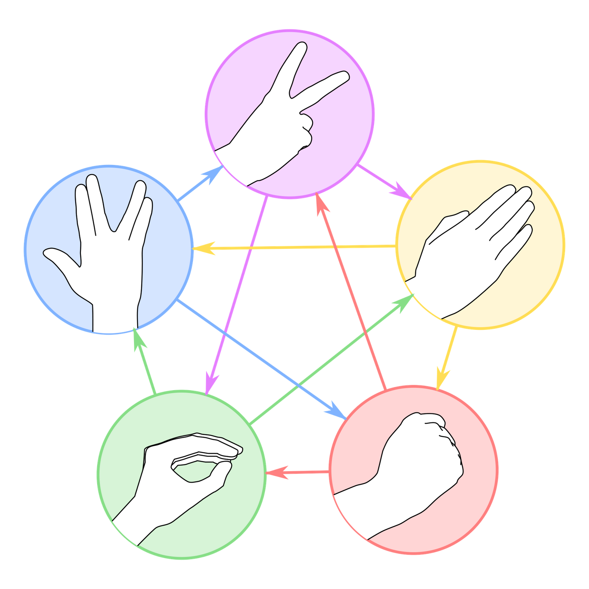

# Rock Paper Scissors Lizard Spock Game

A decentralized Rock Paper Scissors game built on Ethereum using Next.js, TypeScript, and ethers.js.

## Overview

This Rock Paper Scissors Lizard Spock game allows players to compete against each other in a trustless manner using Ethereum smart contracts. The game uses React for the front-end, TypeScript for type safety, and ethers.js for interacting with Ethereum.

## Features

- Trustless gameplay using Ethereum smart contracts
- Encrypted moves for secure and fair play
- User-friendly interface built with React and Tailwind CSS
- Responsive design for mobile and desktop
- Timeout system to handle unresponsive players

## How to Play

1. Player 1 starts a new game by selecting their move, the stake amount, and the Ethereum address of Player 2. The move is encrypted and stored locally, while the stake amount and Player 2's address are sent to the smart contract.
2. Player 2 joins the game by selecting their move and sending the same stake amount to the smart contract.
3. Player 1 reveals their move by decrypting it and sending the result to the smart contract.
4. The smart contract determines the winner and sends the combined stake to the winner's Ethereum address.

## Timeouts

- If Player 2 does not join the game within a specified timeout period, Player 1 can claim the stake back.
- If Player 1 does not reveal their move within the timeout period, Player 2 can claim the stake.

## License

This project is licensed under the MIT License.

## Support Me

